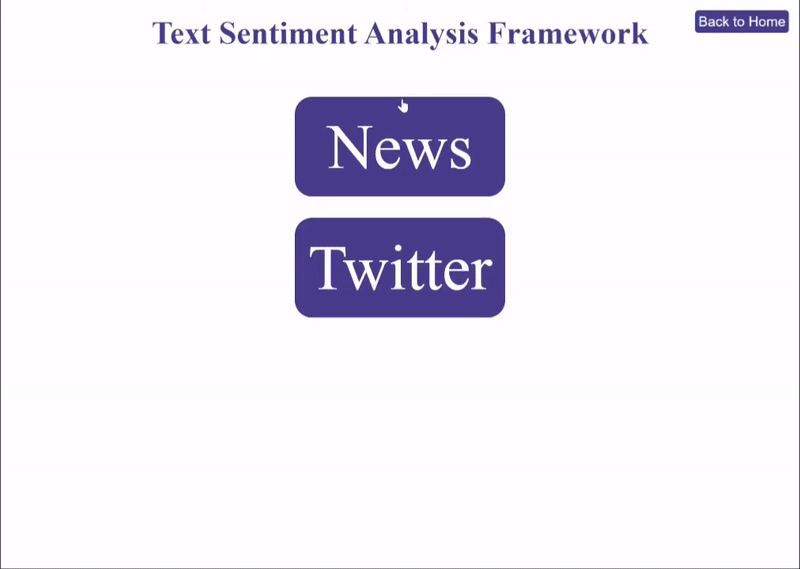

# hw6-analytics-framework-haveagoodday

### Project Overview


This framework utilizes the text passed from data plugins, analyzes the sentiment using Google Natural Language Processiong (NLP) API and calculates scores (positive, neutral, or negative). The returned scores and timestamps would be consumed by visualization plugins, and different charts will be rendered.

In this project, there are two default data plugins and two default visualization plugins for the purpose of demonstration. 

`Data Plugins` can fetch data via APIs and return a list of **Content** class including `text` and `time_stamp`. Sample data plugins are:

-   `TwitterPlugin`
    -   Fetches a list of Twitter Trends which happened within a specific period of time using the Twitter4J API
-   `NewsPlugin`
    -   Fetches a list News Articles that were published within a period of time with News API

The data plugins should have `text` and `time_stamp` fields. Then the framework can go through internal steps to get the sentiment scores, send the results back to the visualization plugins and display them via GUI. 
The result data will have sentiment scores and timestamps.

After being analyzed by Google NLP API, the results are sent to `Visualization Plugins`:

-   Bar charts showing the magnitude of positive`Trends/Events` over time
-   Pie Charts displaying the relative number of positive and negative `Trends/Events`

#### Extensibility
For data plugins 
- As long as data has `text` and `timestamp`, the framework can analyze its sentiment context. 

For Visualization plugins
- No specific restrictions. Available plugins can be added to our framework if they can be correctly rendered via HandleBar.js.

### How to start

Before running this framework, you need to set Environment Path for google NLP API:
````shell
export GOOGLE_APPLICATION_CREDENTIALS=${PROJ_PATH}/${CREDENTIALS_JSON_FILE}
````

It is better to use the absolute path for `PROJ_PATH`, which is the absolute path of `framework-xxxx.json (in this project)` file.

If there is an error occurs like :
```
java.io.IOException: 
The Application Default Credentials are not available. 
They are available if running in Google Compute Engine. Otherwise, the environment variable GOOGLE_APPLICATION_CREDENTIALS must be defined pointing to a file defining the credentials.
```
Try the above `export` command in terminal instead of modifying the configuration of IntelliJ.

After successfully setting `GOOGLE_APPLICATION_CREDENTIALS` environment path, run the framework:
<br>
````
mvn site && mvn exec:exec
````
Then you can check the app locally on the specified port.

#### Things need to pay attention:
- You must choose at least one type chart to visualize your data, or it will not display the sentiment score.
- When choosing time period, the `From`date should be earlier than `To` date, or it will show the error message "Please provide a valid date range." But this won't crash our framework.
- If `To` date is greater than current date, the framework sets `To` date as current date automatically.
- You can choose multiple charts to display the sentiment scores.
